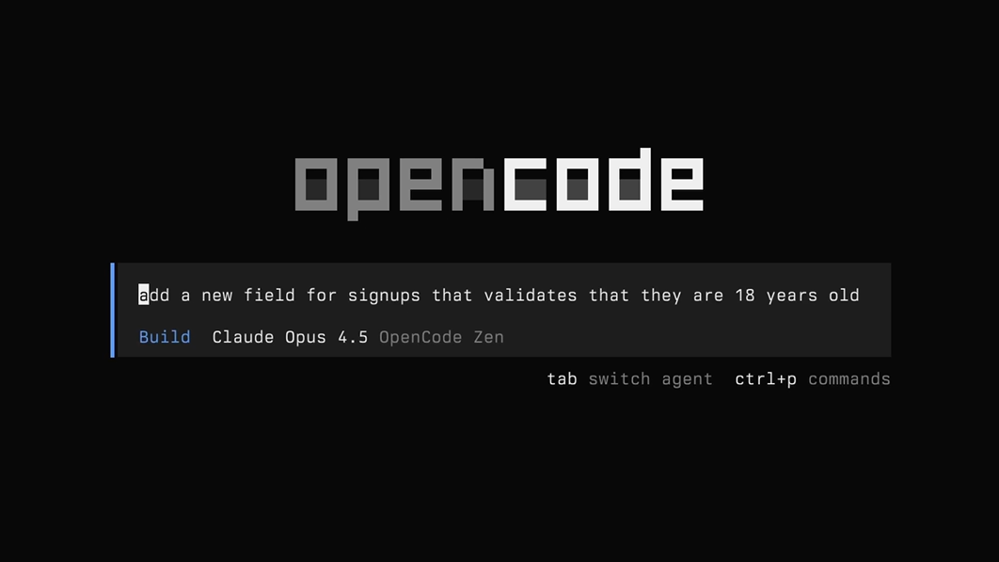

<div align="center">

# OpenCode Cheat Sheet (Beta)

<a href="https://opencode.ai/"></a>

> **Your practical guide to using OpenCode effectively — from first run to advanced agentic workflows.**

A reference for developers who want to leverage OpenCode's agentic capabilities while staying in control. Focuses on patterns that augment your thinking, not replace it.

> **Note:** This is a **Beta** sheet. OpenCode moves fast — we're still aligning every command and example against the live CLI and docs. If something is off (or you quietly notice it isn't), tell us. Until then, treat this as a living draft and verify the surprising bits against the [official OpenCode documentation](https://opencode.ai/docs).

**Based on official OpenCode documentation** — Commands verified against the [OpenCode docs](https://opencode.ai/docs) and `opencode --help` (v1.18.27). For the most up-to-date information, always refer to the official docs.

</div>

## Quick Start

```bash
# Install with the official install script (recommended)
curl -fsSL https://opencode.ai/install | bash

# Or with Node.js
npm install -g opencode-ai

# Or with Bun
bun install -g opencode-ai

# Or with pnpm
pnpm install -g opencode-ai

# Or with Homebrew (most up to date: the OpenCode tap)
brew install anomalyco/tap/opencode

# Launch OpenCode in the current project
cd /path/to/project
opencode

# Check version
opencode --version
```

## Table of Contents

- **[Level 1: Getting Started](#level-1-getting-started)**
- **[Level 2: Basic Commands](#level-2-basic-commands)**
- **[Level 3: Intermediate Usage](#level-3-intermediate-usage)**
- **[Skills](#skills)** — Reusable, on-disk capabilities
- **[Level 4: Advanced Features](#level-4-advanced-features)**
- **[Level 5: Expert Workflows](#level-5-expert-workflows)**
- **[Command Reference](#command-reference)**
- **[Best Practices](#best-practices)**

## Level 1: Getting Started

Essential commands to start using OpenCode effectively.

<details>
<summary><strong>Installation & Setup</strong></summary>

```bash
# Install with the official script
curl -fsSL https://opencode.ai/install | bash

# Or with a package manager
npm install -g opencode-ai
bun install -g opencode-ai
pnpm install -g opencode-ai

# Homebrew (macOS / Linux) — the OpenCode tap is most current
brew install anomalyco/tap/opencode

# Verify installation
opencode --version
```

On Windows, OpenCode recommends WSL. Native options also exist:

```bash
# Chocolatey
choco install opencode

# Scoop
scoop install opencode

# npm
npm install -g opencode-ai
```

</details>

<details>
<summary><strong>First Steps & Authentication</strong></summary>

```bash
# Start the TUI in the current directory
opencode

# Start for a specific project path
opencode /path/to/project

# Authenticate a provider (stores keys in ~/.local/share/opencode/auth.json)
opencode providers login

# List authenticated providers
opencode providers ls

# Log out of a provider
opencode providers logout
```

`opencode providers` manages AI providers and credentials (`auth` is an alias).

In the TUI, `/connect` opens the same provider setup flow and points you to
[opencode.ai/auth](https://opencode.ai/auth) for API keys. You can also sign in
with GitHub (Copilot) or OpenAI (ChatGPT Plus/Pro) directly.

</details>

<details>
<summary><strong>Initialize a Project</strong></summary>

```bash
# Inside the TUI, analyze the project and create an AGENTS.md
/init
```

`/init` generates an `AGENTS.md` in the project root with structure and coding
patterns. Commit it to Git so OpenCode (and teammates) get project context on
every run.

</details>

<details>
<summary><strong>Basic Navigation</strong></summary>

```bash
# Keyboard shortcuts in the TUI (leader key: ctrl+x)
ctrl+x n                  # New session (alias: /clear)
ctrl+x l                  # List/switch sessions (alias: /sessions, /resume, /continue)
ctrl+x u                  # Undo last message + file changes (needs Git repo)
ctrl+x r                  # Redo an undone message
ctrl+x c                  # Compact / summarize session (alias: /compact)
ctrl+x e                  # Open external editor (alias: /editor)
ctrl+x x                  # Export conversation to Markdown (alias: /export)
ctrl+x q                  # Exit (alias: /exit, /quit, /q)
ctrl+x m                  # List models (alias: /models)
ctrl+x t                  # List themes (alias: /themes)

# Message prefixes
@path/to/file.ts         # Fuzzy file reference (adds file contents to context)
!ls -la                  # Run a shell command inline
```

</details>

## Level 2: Basic Commands

Core patterns for everyday development.

<details>
<summary><strong>Slash Commands — Essentials</strong></summary>

Use these inside an active OpenCode session (type `/` to see the popup).

```bash
/connect                  # Add a provider and paste API keys
/compact                  # Compact session context (alias: /summarize)
/details                  # Toggle tool execution details
/editor                   # Compose message in $EDITOR
/exit                     # Quit OpenCode (aliases: /quit, /q)
/export                   # Export conversation to Markdown
/help                     # Show help dialog
/init                     # Create or update AGENTS.md
/models                   # List available models
/new                      # Start a new session (alias: /clear)
/redo                     # Redo an undone message
/sessions                 # List and switch sessions (aliases: /resume, /continue)
/share                    # Share current session (creates a link)
/themes                   # List available themes
/thinking                 # Toggle visibility of thinking/reasoning blocks
/undo                     # Undo last message and its file changes
/unshare                  # Unshare current session
```

</details>

<details>
<summary><strong>Agents: Build vs Plan</strong></summary>

OpenCode ships two built-in primary agents you cycle between with the **Tab** key:

- **Build** — the default agent, all tools enabled. Use for real implementation work.
- **Plan** — read-only planning agent. `edit` and `bash` default to `ask`, so it
  analyzes and proposes without changing your code. Great for "how should I
  approach this?" before you commit to changes.

Subagents (invoke with `@` in a message):

```bash
@general     # General-purpose agent; can make file changes, run in parallel
@explore     # Fast, read-only codebase exploration
@scout       # Read-only external docs / dependency research
```

**When to use each:**
- **Build**: Default for implementation — full file + shell access.
- **Plan**: Analyze, propose, review — no unintended changes.
- **Explore/Scout**: Dig into a codebase or upstream docs without touching files.

</details>

<details>
<summary><strong>File and Directory Operations</strong></summary>

```bash
# Reference files with @ (fuzzy search in the working directory)
"How is auth handled in @packages/functions/src/api/index.ts?"

# Reference a configured reference root
"Compare our setup with @docs/README.md"

# OpenCode reads, writes, and edits files as part of normal work
"Add error handling to src/utils.py"
"Create a new file called components/Button.tsx"
```

</details>

<details>
<summary><strong>Working with Code</strong></summary>

```bash
# Explain and analyze
"Explain what this code does"
"Review this function for bugs"

# Generate and refactor
"Write a function to parse JSON safely"
"Refactor this module to use async/await"

# Use Plan mode first for non-trivial changes
# Press Tab -> describe the feature -> review the plan -> Tab -> "go ahead"
```

</details>

<details>
<summary><strong>Session Management</strong></summary>

```bash
# In the TUI
/new                       # Start a fresh session
/sessions                  # List + switch (alias: /resume, /continue)

# From the CLI
opencode session list                 # List all sessions
opencode session list -n 10           # Last 10 sessions
opencode session delete <sessionID>   # Delete a session

# Continue the last session
opencode -c
opencode --continue

# Resume a specific session
opencode -s <sessionID>
opencode --session <sessionID>

# Fork a session (keeps the original intact)
opencode -c --fork
```

Sessions persist context — use them for multi-turn problem solving. `--fork`
copies the session so you can explore a different direction safely.

</details>

<details>
<summary><strong>Useful CLI Flags</strong></summary>

```bash
# Model selection (provider/model format)
opencode -m anthropic/claude-sonnet-4-5 "your prompt"
opencode run -m opencode/gpt-5.1-codex "explain this"

# Continue / resume
opencode -c                              # Continue last session
opencode -s <sessionID> --fork           # Resume + fork

# Agent and prompt
opencode --agent plan "draft a migration plan"
opencode --prompt "summarize this repo"

# Auto-approve (dangerous — skips permission prompts for non-denied actions)
opencode run --auto "refactor src/"

# Attach to a running server (avoids MCP cold boots)
opencode run --attach http://localhost:4096 "explain async/await"
```

</details>

## Level 3: Intermediate Usage

Configuration and customization options.

<details>
<summary><strong>Configuration</strong></summary>

OpenCode uses a JSON or JSONC config (`opencode.json` / `opencode.jsonc`). It supports
both formats and loads from several locations, **merged** (not replaced):

1. Remote config (`.well-known/opencode`) — org defaults
2. Global config — `~/.config/opencode/opencode.json`
3. Custom config — `OPENCODE_CONFIG` env var
4. Project config — `opencode.json` in the project root (highest standard precedence)
5. `.opencode/` directories — agents, commands, skills, plugins
6. Inline — `OPENCODE_CONFIG_CONTENT` env var

```jsonc
{
  "$schema": "https://opencode.ai/config.json",
  "model": "anthropic/claude-sonnet-4-5",
  "autoupdate": true,
  "server": { "port": 4096 }
}
```

TUI-specific settings live in a separate `tui.json` (or `tui.jsonc`):

```jsonc
{
  "$schema": "https://opencode.ai/tui.json",
  "theme": "opencode",
  "leader_timeout": 2000,
  "keybinds": { "command_list": "ctrl+p" }
}
```

See [Config Reference](https://opencode.ai/docs/config/) for the full schema.

</details>

<details>
<summary><strong>Model Selection</strong></summary>

```bash
# List every model available across your configured providers
opencode models

# Filter by provider
opencode models anthropic

# Refresh the cached model list from models.dev
opencode models --refresh

# Verbose output includes costs/metadata
opencode models --verbose
```

Set a default model in config:

```jsonc
{
  "model": "anthropic/claude-sonnet-4-5",
  "small_model": "anthropic/claude-haiku-4-5"
}
```

Model IDs use the `provider/model-id` format. With [OpenCode Zen](https://opencode.ai/zen)
you can use curated entries like `opencode/gpt-5.1-codex`. Cycle reasoning variants
with `ctrl+t` in the TUI.

</details>

<details>
<summary><strong>AGENTS.md for Project Context</strong></summary>

```bash
# Run inside the TUI to generate AGENTS.md
/init
```

`AGENTS.md` (and any files referenced via `instructions` in config) gives OpenCode
project-specific context. Commit it to Git.

```markdown
# Project Guidelines

## Tech Stack
- Node.js with Fastify
- PostgreSQL
- Vitest for testing

## Patterns
- Use dependency injection
- Prefer async functions for I/O
- Follow the existing ESLint rules
```

You can also point OpenCode at instruction files globally:

```jsonc
{
  "instructions": ["CONTRIBUTING.md", "docs/guidelines.md", ".cursor/rules/*.md"]
}
```

</details>

<details>
<summary><strong>Permissions</strong></summary>

By default OpenCode **allows all operations** without prompting. Tighten that in config:

```jsonc
{
  "permission": {
    "edit": "ask",
    "bash": "ask"
  }
}
```

Permission values: `"allow"`, `"ask"`, `"deny"`. Keys accept glob patterns, so you
can scope bash precisely:

```jsonc
{
  "agent": {
    "build": {
      "permission": {
        "bash": {
          "*": "ask",
          "git status *": "allow"
        }
      }
    }
  }
}
```

Available permission keys: `read`, `edit`, `glob`, `grep`, `list`, `bash`, `task`,
`external_directory`, `todowrite`, `webfetch`, `websearch`, `lsp`, `skill`, `question`.
See [Permissions](https://opencode.ai/docs/permissions/) for details.

</details>

## Skills

<a id="skills"></a>

- **What they are:** Reusable, on-disk instructions OpenCode discovers automatically. Each skill is a folder with a `SKILL.md` (YAML frontmatter + body). The agent loads them on demand via the native `skill` tool.
- **Where skills live:** OpenCode searches these locations (project paths walk up to the git worktree; global paths are always loaded):
  - Project: `.opencode/skills/<name>/SKILL.md`
  - Global: `~/.config/opencode/skills/<name>/SKILL.md`
  - Claude-compatible: `.claude/skills/<name>/SKILL.md`, `~/.claude/skills/<name>/SKILL.md`
  - Agent-compatible: `.agents/skills/<name>/SKILL.md`, `~/.agents/skills/<name>/SKILL.md`
- **File format (YAML frontmatter + body):**
  ```markdown
  ---
  name: your-skill-name          # required, 1-64 chars, lowercase + hyphens only
  description: when/why to use   # required, 1-1024 chars
  license: MIT                   # optional
  ---
  
  # Optional body (loaded on demand)
  Add references, workflows, or examples here.
  ```
- **Using skills:** The agent sees available skills in its `skill` tool description and loads the full content when needed. Reference them from `AGENTS.md` or prompts.
- **Permissions per skill:** Control access in config with pattern-based rules:
  ```jsonc
  {
    "permission": {
      "skill": {
        "*": "allow",
        "internal-*": "deny",
        "experimental-*": "ask"
      }
    }
  }
  ```
- **Sample skills in this repo:** Copy or symlink any of the samples below into `.opencode/skills/<name>/SKILL.md`, then restart OpenCode:
  - `skills/mcp-setup/SKILL.md`
  - `skills/session-management/SKILL.md`
  - `skills/plan-mode/SKILL.md`
- **Troubleshooting:** If a skill doesn't appear — verify `SKILL.md` is all caps, confirm `name` + `description` frontmatter, ensure the name is unique, and check that permissions don't `deny` it.

See [Agent Skills](https://opencode.ai/docs/skills/) for details.

## Level 4: Advanced Features

Powerful features for complex workflows.

<details>
<summary><strong>MCP Integration</strong></summary>

MCP (Model Context Protocol) adds external tools alongside OpenCode's built-ins.

```bash
# Add an MCP server (interactive prompt for local/remote)
opencode mcp add

# List servers and connection status
opencode mcp list            # or: opencode mcp ls

# Authenticate an OAuth-enabled server
opencode mcp auth <name>
opencode mcp auth list      # auth status for all OAuth-capable servers

# Remove stored OAuth credentials
opencode mcp logout <name>

# Debug OAuth / connectivity for a server
opencode mcp debug <name>
```

Configure servers in `opencode.json` (local example):

```jsonc
{
  "mcp": {
    "mcp_everything": {
      "type": "local",
      "command": ["npx", "-y", "@modelcontextprotocol/server-everything"]
    }
  }
}
```

Remote example (with auth headers):

```jsonc
{
  "mcp": {
    "context7": {
      "type": "remote",
      "url": "https://mcp.context7.com/mcp",
      "headers": { "CONTEXT7_API_KEY": "{env:CONTEXT7_API_KEY}" }
    }
  }
}
```

OAuth-enabled remote servers need no special config — OpenCode detects the 401 and
runs the flow automatically. Disable a server with `"enabled": false`.

> **Tip:** MCP servers add to context. Be selective — a server like GitHub MCP can
> blow past the context limit fast.

See [MCP Servers](https://opencode.ai/docs/mcp-servers/) for details.

</details>

<details>
<summary><strong>Agents & Custom Agents</strong></summary>

Define specialized agents in `opencode.json` or as markdown in
`~/.config/opencode/agents/` (or `.opencode/agents/`).

Markdown agent (`.opencode/agents/review.md`):

```markdown
---
description: Reviews code for quality and best practices
mode: subagent
permission:
  edit: deny
  bash: deny
---
You are in code review mode. Focus on code quality, potential bugs,
performance, and security. Provide feedback without making changes.
```

JSON config:

```jsonc
{
  "agent": {
    "code-reviewer": {
      "description": "Reviews code for best practices and potential issues",
      "mode": "subagent",
      "model": "anthropic/claude-sonnet-4-5",
      "prompt": "You are a code reviewer. Focus on security, performance, maintainability.",
      "permission": { "edit": "deny" }
    }
  },
  "default_agent": "plan"   // optional: change the default primary agent
}
```

Manage agents from the CLI:

```bash
opencode agent list                       # List all available agents
opencode agent create                     # Interactive agent creator
opencode agent create --path .opencode/agents \
  --description "Docs writer" --mode subagent --permissions "read,bash:deny"
```

Built-in modes: `primary` (interact directly, cycle with Tab), `subagent` (invoke
via `@` or by the model), `all`. See [Agents](https://opencode.ai/docs/agents/) for details.

</details>

<details>
<summary><strong>Custom Commands</strong></summary>

Create repeatable prompts as commands. Place markdown in
`~/.config/opencode/commands/` or `.opencode/commands/`.

`.opencode/commands/component.md`:

```markdown
---
description: Create a new component
---
Create a new React component named $ARGUMENTS with TypeScript support.
Include proper typing and basic structure.
```

Run it in the TUI:

```bash
/component Button
```

Prompts support shell output (`!`command``) and file references (`@file`):

```markdown
---
description: Review recent changes
---
Recent git commits:
!`git log --oneline -10`
Review these changes and suggest improvements.
```

See [Commands](https://opencode.ai/docs/commands/) for details.

</details>

<details>
<summary><strong>Non-Interactive & Scripting</strong></summary>

```bash
# Run a single prompt and exit
opencode run "Explain how closures work in JavaScript"

# Attach files to the message
opencode run -f src/app.ts "review this file"

# Output raw JSON events (for automation)
opencode run --format json "list the exported functions in main.go"

# Continue / fork / share from a run
opencode run -c "add tests for utils.ts"
opencode run -s <sessionID> --fork "try a different approach"
opencode run --share "draft the API spec"

# Pipe content in
cat error.log | opencode run "find the root cause"
git diff | opencode run "write a commit message"

# Title the session
opencode run --title "Spike: auth refactor" "plan the work"
```

`opencode run` is the scripting entry point — pair it with `--attach` to a running
`opencode serve` to skip MCP cold boots. See [CLI](https://opencode.ai/docs/cli/) for details.

</details>

<details>
<summary><strong>Server, Web & ACP</strong></summary>

```bash
# Headless HTTP server (API access, no TUI)
opencode serve --port 4096

# Headless server + web interface (opens browser)
opencode web --port 4096

# Attach a TUI to a running backend (remote access)
opencode attach http://10.20.30.40:4096

# ACP (Agent Client Protocol) server over stdio
opencode acp

# Run the GitHub agent (typically in Actions)
opencode github run
opencode github install     # Sets up the repo GitHub Actions workflow
```

Set `OPENCODE_SERVER_PASSWORD` to require HTTP basic auth on `serve`/`web`.
See [Server](https://opencode.ai/docs/server/) and [ACP](https://opencode.ai/docs/acp/).

</details>

<details>
<summary><strong>Sharing & Importing Sessions</strong></summary>

```bash
# In the TUI
/share                      # Create a share link (copied to clipboard)
/unshare                    # Remove the share

# From the CLI
opencode run --share "walk through the bug"
opencode export <sessionID> --sanitize   # Redact sensitive data

# Import a session from file or share URL
opencode import session.json
opencode import https://opncd.ai/s/abc123
```

Sharing is off by default — you opt in per session. Configure globally:

```jsonc
{ "share": "manual" }   // "manual" | "auto" | "disabled"
```

See [Share](https://opencode.ai/docs/share/) for details.

</details>

## Level 5: Expert Workflows

Advanced patterns and automation for power users.

<details>
<summary><strong>Stats & Cost Tracking</strong></summary>

```bash
# Token usage and cost across sessions
opencode stats

# Last N days
opencode stats --days 30

# Top models breakdown
opencode stats --models 5

# Filter by project
opencode stats --project /path/to/project
```

Use this to spot expensive models and trim waste.

</details>

<details>
<summary><strong>Plan-Mode Workflows</strong></summary>

For non-trivial changes, separate thinking from doing:

1. Press **Tab** to switch to the **Plan** agent (read-only).
2. Describe the feature with context and examples.
3. Review the proposed plan and iterate.
4. Press **Tab** back to **Build**, then: "Sounds good, go ahead."

This keeps OpenCode from editing files until you've signed off — useful for
refactors, migrations, and anything you'd want a junior dev to plan first.

</details>

<details>
<summary><strong>Parallel Subagents</strong></summary>

Offload independent research with subagents:

```bash
@general research the rate-limit behavior of the Stripe SDK
@explore find every place we call the legacy auth module
@scout check how Next.js 15 handles caching vs our current setup
```

Primary agents can also launch subagents automatically. Control nesting depth:

```jsonc
{ "subagent_depth": 2 }   // 1 = default (one level); 0 = disable subagents
```

Control which subagents an agent may invoke:

```jsonc
{
  "agent": {
    "orchestrator": {
      "permission": { "task": { "*": "deny", "code-reviewer": "ask" } }
    }
  }
}
```

</details>

<details>
<summary><strong>Plugins & Ecosystem</strong></summary>

```bash
# Install a plugin (updates config automatically)
opencode plugin opencode-helicone-session
opencode plug @my-org/custom-plugin          # alias: plug

# Install globally
opencode plugin -g some-plugin

# Force replace an existing version
opencode plugin -f some-plugin
```

Plugins live in `.opencode/plugins/` or `~/.config/opencode/plugins/`, or load from
npm via the `plugin` config key. See [Plugins](https://opencode.ai/docs/plugins/).

</details>

<details>
<summary><strong>Debugging & Troubleshooting</strong></summary>

```bash
# Inspect the fully resolved config (incl. managed settings)
opencode debug config

# Other debug tooling
opencode debug

# Database tools
opencode db path            # Print the database path
opencode db <query>         # Run a query (--format json|tsv)

# Uninstall OpenCode
opencode uninstall --keep-config   # keep config files
opencode uninstall --dry-run       # preview what gets removed
```

When a remote MCP server fails to authenticate, `opencode mcp debug <name>` shows
auth status and tests the OAuth discovery flow. See
[Troubleshooting](https://opencode.ai/docs/troubleshooting/).

</details>

<details>
<summary><strong>Upgrading</strong></summary>

```bash
# Upgrade to the latest version
opencode upgrade

# Upgrade to a specific version
opencode upgrade v0.1.48

# Disable autoupdate checks
export OPENCODE_DISABLE_AUTOUPDATE=1
```

To keep autoupdate on but only notify: `"autoupdate": "notify"` in config (only
when not installed via a package manager).

</details>

## Command Reference

### Global CLI Commands

| Command | Description |
|---------|-------------|
| `opencode` | Start the TUI in the current directory (or `[project]`) |
| `opencode run [msg]` | Run a prompt non-interactively |
| `opencode completion` | Generate shell completion script |
| `opencode providers` | Manage AI providers and credentials (`login`, `list`/`ls`, `logout`; alias: `auth`) |
| `opencode models [provider]` | List available models |
| `opencode mcp` | Manage MCP servers (`add`, `list`/`ls`, `auth`, `logout`, `debug`) |
| `opencode agent` | Manage agents (`create`, `list`) |
| `opencode session` | Manage sessions (`list`, `delete <id>`) |
| `opencode github` | Manage the GitHub agent (`install`, `run`) |
| `opencode serve` | Start a headless HTTP server |
| `opencode web` | Start a headless server with web UI |
| `opencode attach [url]` | Attach a TUI to a running backend |
| `opencode acp` | Start an ACP server (stdio) |
| `opencode plugin <module>` | Install a plugin (`plug` alias) |
| `opencode pr <number>` | Checkout a GitHub PR branch, then run OpenCode |
| `opencode export [id]` | Export a session as JSON |
| `opencode import <file\|url>` | Import a session from file or share URL |
| `opencode stats` | Token usage and cost statistics |
| `opencode db [query]` | Database tools |
| `opencode debug` | Debugging and troubleshooting tools |
| `opencode upgrade [target]` | Upgrade OpenCode |
| `opencode uninstall` | Uninstall OpenCode |

### Common Global Flags

| Flag | Description |
|------|-------------|
| `-m, --model` | Model in `provider/model` format |
| `-c, --continue` | Continue the last session |
| `-s, --session` | Session ID to continue |
| `--fork` | Fork the session when continuing |
| `--prompt` | Prompt to use |
| `--agent` | Agent to use |
| `--auto` | Auto-approve non-denied permissions (dangerous) |
| `--pure` | Run without external plugins |
| `-v, --version` | Print version number |
| `-h, --help` | Show help |

### TUI Keybinds (leader: ctrl+x)

| Keybind | Action |
|---------|--------|
| `ctrl+x n` | New session (`/new`, `/clear`) |
| `ctrl+x l` | List/switch sessions (`/sessions`) |
| `ctrl+x u` | Undo last message (`/undo`) |
| `ctrl+x r` | Redo undone message (`/redo`) |
| `ctrl+x c` | Compact session (`/compact`) |
| `ctrl+x e` | External editor (`/editor`) |
| `ctrl+x x` | Export to Markdown (`/export`) |
| `ctrl+x m` | List models (`/models`) |
| `ctrl+x t` | List themes (`/themes`) |
| `ctrl+x q` | Quit (`/exit`) |
| `Tab` | Cycle primary agents (Build / Plan) |
| `ctrl+t` | Cycle model variants (reasoning effort) |

### Built-in Agents

| Agent | Mode | Use it for |
|-------|------|------------|
| `build` | primary | Default — full tool access for implementation |
| `plan` | primary | Read-only analysis and planning |
| `general` | subagent | Multi-step work; can change files; runs in parallel |
| `explore` | subagent | Fast, read-only codebase exploration |
| `scout` | subagent | Read-only external docs / dependency research |

## Best Practices

### Think Critically

OpenCode is an assistant, not a replacement for your judgment:

- **Review changes** before accepting — understand what changed and why (use `/undo` to roll back)
- **Use Plan mode** for non-trivial work — get a proposal, then approve
- **Ask with context** — reference files with `@`, give examples, talk to it like a teammate
- **Question assumptions** — if something feels off, dig deeper

### Stay Secure

- Never commit API keys — they live in `~/.local/share/opencode/auth.json`, not your repo
- Tighten permissions with `"ask"`/`"deny"` for `edit` and `bash` in shared/unknown codebases
- Be selective with MCP servers — they add to context and can exceed limits
- Use `export --sanitize` before sharing sessions that contain secrets

### Work Effectively

- Run `/init` and commit `AGENTS.md` for project context
- Create skills for repetitive, domain-specific workflows
- Use sessions for multi-turn problems; `--fork` to explore safely
- Combine OpenCode with traditional tools (`git`, `grep`, your editor)
- Leverage subagents (`@general`, `@explore`, `@scout`) for parallel research

### Continuous Learning

- Run `opencode models --refresh` when a provider adds new models
- Use `/thinking` to see the model's reasoning on hard problems
- Build your own agents and commands for team patterns
- Check `opencode stats` to understand cost and model usage

## Additional Resources

**Official OpenCode Documentation:**
- [OpenCode](https://opencode.ai/) — Home, install, and overview
- [Docs](https://opencode.ai/docs) — Full documentation hub
- [Intro / Getting Started](https://opencode.ai/docs/) — Install, configure, initialize
- [CLI Reference](https://opencode.ai/docs/cli/) — Every subcommand and flag
- [TUI Reference](https://opencode.ai/docs/tui/) — Slash commands and keybinds
- [Config Reference](https://opencode.ai/docs/config/) — `opencode.json` schema
- [Agents](https://opencode.ai/docs/agents/) — Built-in and custom agents
- [Agent Skills](https://opencode.ai/docs/skills/) — Reusable SKILL.md capabilities
- [Commands](https://opencode.ai/docs/commands/) — Custom commands
- [MCP Servers](https://opencode.ai/docs/mcp-servers/) — External tool integration
- [Permissions](https://opencode.ai/docs/permissions/) — Approval policies
- [Share](https://opencode.ai/docs/share/) — Session sharing
- [GitHub Agent](https://opencode.ai/docs/github/) — Repo automation
- [Troubleshooting](https://opencode.ai/docs/troubleshooting/)

**Repository & Community:**
- [GitHub: anomalyco/opencode](https://github.com/anomalyco/opencode) — Source and issues
- [Discord](https://opencode.ai/discord) — Community Q&A
- [Zen](https://opencode.ai/zen/) — Curated, benchmarked models for coding agents

**Related Tools:**
- [Codex Cheat Sheet](https://github.com/BA-CalderonMorales/codex-cheat-sheet) — Companion guide for OpenAI Codex CLI
- [Kimi Cheat Sheet](https://github.com/BA-CalderonMorales/kimi-cheat-sheet) — Companion guide for Kimi Code CLI

> **Tip**: Always check the [official OpenCode documentation](https://opencode.ai/docs) for the latest features and updates. This cheat sheet is a quick reference, but the official docs contain the most comprehensive and up-to-date information.

## Contributing

Found an issue, or notice something is off? Contributions are welcome — this is a Beta sheet, so corrections matter.

- Report bugs or inconsistencies
- Suggest new examples
- Share your workflows
- Improve documentation

## License

MIT License — Free to use and modify.

---

**Last updated: September 2026**
**Based on**: OpenCode CLI (npm: opencode-ai, v1.18.27)

*This is a Beta reference. Commands and examples are verified against `opencode --help` and the official docs, but OpenCode evolves quickly — flag anything that drifts.*

*Last synced: 2026-09-03 via [workspace manager](https://github.com/BA-CalderonMorales)*

---
